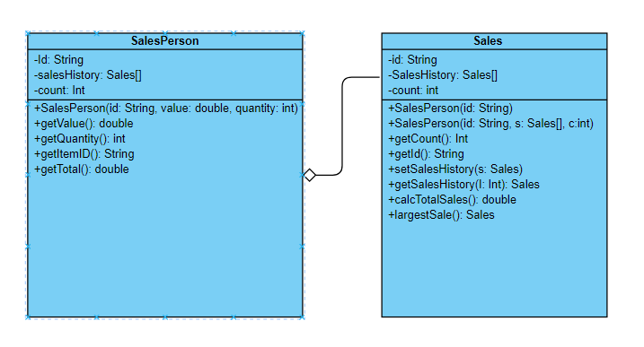

# Forum Week 9

## Number 1

**(a.) By making use of an example from the above scenario, distinguish between a class and an instantiation of a class.**

Class is a user-defined datatype that contain its own data members and member functions. The member functions and data members can be accessed with the help of objects.On the other hand, an instantiation is a realization of a class, also known as an object. When a class is instantiated, a specific instance of that class is created, with its own set of properties and behaviours.

**(b.) By giving two examples, explain how the principles of inheritance can be incorporated into the design of this administration program.**

Employee Inheritance:
The administration program can have a base class called "Employee" that represents common attributes and behaviors of all employees in the company, such as name, ID, and salary. This base class can be inherited by more specialized classes like "Manager," "OfficeStaff," and "SalesPersonnel," which would inherit the common attributes from the "Employee" class and add their specific attributes or behaviors.

GUI Inheritance:
Since the GUIs in different modules of the program have a similar design with specific differences, the program can have a base GUI class that defines the common structure and behavior of the GUI, such as buttons, menus, and layout. Then, specialized classes can be derived from this base class, each representing a specific module. These specialized classes can inherit the common GUI elements from the base class and add or modify elements specific to each module.

**(c.) Describe how the use of libraries can facilitate the development of programs like this company’s administration program.**

Libraries are pre-existing collections of code that provide reusable functionalities.
1. Reusable Code: Libraries contain pre-built functions and classes that can be directly used in the program. Instead of reinventing the wheel, developers can leverage these libraries to perform common tasks like handling file operations, database connectivity, or user interface components. This saves time and effort in programming.

2. Abstraction and Modularity: Libraries provide an abstraction layer, allowing developers to focus on the high-level logic of their program rather than low-level implementation details. They encapsulate complex operations into simple function calls or classes, making the code more modular, readable, and maintainable.

3. Enhanced Functionality: Libraries often offer additional features and capabilities beyond the standard programming language. By utilizing libraries, the company's administration program can leverage advanced algorithms, data structures, or specialized tools relevant to specific business requirements, leading to more efficient and feature-rich software.

In summary, libraries simplify development by providing ready-made code, promoting abstraction and modularity, and enhancing the program's functionality with advanced features.

## Number 2

**(a.) Complete the constructor public SalesPerson(String id), from the SalesPerson class.**

*In the SalesPerson Class*

**(b.) Explain why accessor methods are necessary for the SalesPerson class.**

Accessor methods are necessary for the Salesperson class because it is used to access attributes that are private, so it can’t be changed outside of its own class.

**(c.)(i.) Construct unified modelling language (UML) diagrams to clearly show the relationship between the SalesPerson and Sales classes.**

**(c.)(ii.) Outline a negative effect that a future change in the design of the Sales object might have on this suite of programs.**

One negative effect would be compatibility issue between Sales and other classes, such as SalesPerson, as the methods in said class rely on the objects in the Sales class. This means that SalesPerson and other classes requires extensive modifications to work with the updated Sales class.

**(d.) State the output after running this code.**

**(e.) Construct the method calcTotalSales(), in the SalesPerson class that calculates the total value of the sales for a specific SalesPerson object.**

*In the SalesPerson class*

**(f.) By making use of any previously written methods, construct the method highest() that returns the ID of the salesperson whose sales have the largest total value.**

*In the Driver class*

**(g.) Construct the method addSales(Sales s, String id), in the Driver class, that will add a new Sales object s, to the salesperson with a specified ID.**

*In the Driver class*

**(h.) Suggest changes that must be made to the SalesPerson class and/or the Sales class to allow these calculations to be made.**

A date variable should be added, it would also require getters and setters.

**(i.) Discuss the use of polymorphism that occurs in this suite of programs.**

The polymorphism in this program occurs in the SalesPerson class, where it has overloading because of the 2 constructors in the class.
